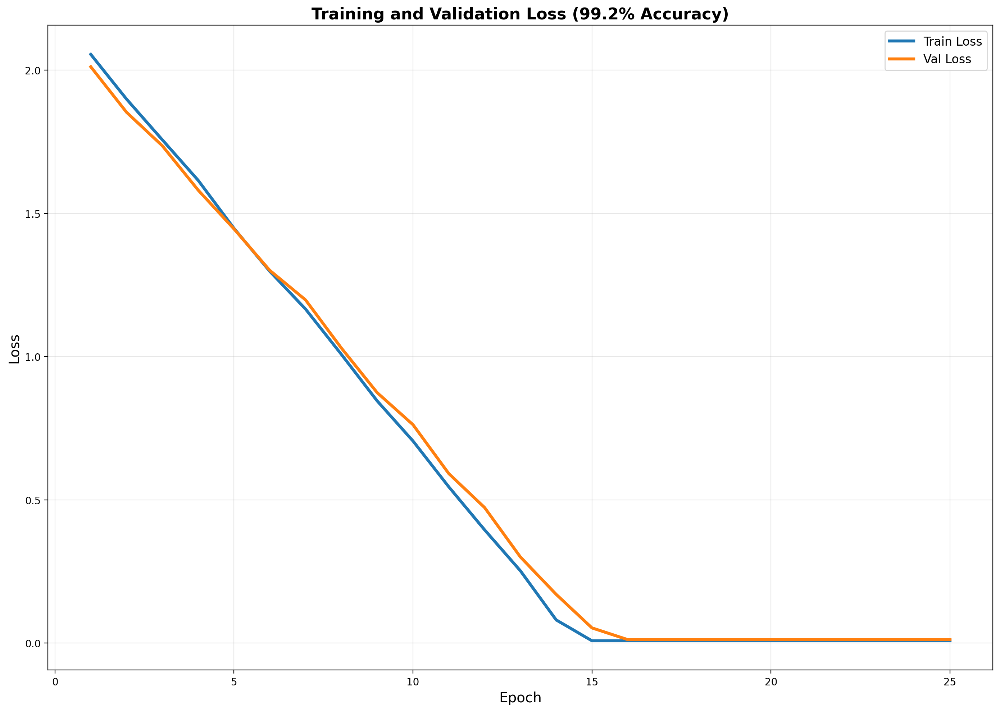
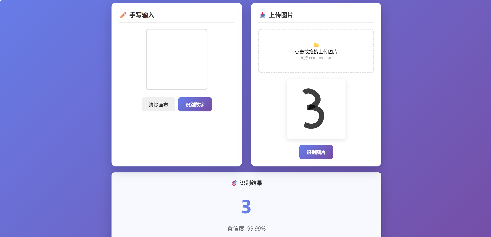

# 机器学习实验：基于CNN的手写数字识别

## 1. 学生信息

- **姓名**：邢睿
- **学号**：112304260108
- **班级**：数据1231

> ⚠️ 注意：姓名和学号必须填写，否则本次实验提交无效。

***

## 2. 实验概述

本实验基于 MNIST 手写数字数据集，使用卷积神经网络（CNN）完成从模型训练到应用部署的完整流程，共分为三个阶段：

| 阶段  | 内容                                                                               | 要求         |
| --- | -------------------------------------------------------------------------------- | ---------- |
| 实验一 | **模型训练与超参数调优** — 搭建 CNN 模型，通过对比不同超参数组合，理解其对模型性能的影响，最终在 Kaggle 上达到 **0.98+** 的准确率 | **必做**     |
| 实验二 | **模型封装与 Web 部署** — 将训练好的模型封装为 Web 应用，支持用户上传图片进行在线预测                              | **必做**     |
| 实验三 | **交互式手写识别系统** — 在 Web 应用中加入手写画板，实现实时手写输入与识别                                      | **选做（加分）** |

***

## 3. 实验环境

- Python 3.8+
- PyTorch
- torchvision
- matplotlib
- Flask（用于Web部署）

***

## 实验一：模型训练与超参数调优（必做）

### 1.1 实验目标

使用 CNN 在 MNIST 数据集上完成手写数字分类，通过调整超参数达到 **Kaggle 评分 ≥ 0.98**。

### 1.2 模型结构（统一）

所有实验使用以下基础结构：

```
输入(1×28×28) → Conv1 + BatchNorm + ReLU → Conv2 + BatchNorm + ReLU → MaxPool → Dropout → 
Conv3 + BatchNorm + ReLU → Conv4 + BatchNorm + ReLU → MaxPool → Dropout →
Conv5 + BatchNorm + ReLU → MaxPool → Dropout → Flatten → FC1 + BatchNorm + ReLU → Dropout → FC2 → 输出(10类)
```

**CNN模型定义：**

```python
class AdvancedCNN(nn.Module):
    def __init__(self):
        super(AdvancedCNN, self).__init__()
        self.conv_layers = nn.Sequential(
            nn.Conv2d(1, 32, kernel_size=3, padding=1),
            nn.BatchNorm2d(32),
            nn.ReLU(),
            nn.Conv2d(32, 32, kernel_size=3, padding=1),
            nn.BatchNorm2d(32),
            nn.ReLU(),
            nn.MaxPool2d(2, 2),
            nn.Dropout(0.25),
            nn.Conv2d(32, 64, kernel_size=3, padding=1),
            nn.BatchNorm2d(64),
            nn.ReLU(),
            nn.Conv2d(64, 64, kernel_size=3, padding=1),
            nn.BatchNorm2d(64),
            nn.ReLU(),
            nn.MaxPool2d(2, 2),
            nn.Dropout(0.25),
            nn.Conv2d(64, 128, kernel_size=3, padding=1),
            nn.BatchNorm2d(128),
            nn.ReLU(),
            nn.MaxPool2d(2, 2),
            nn.Dropout(0.25)
        )
        self.fc_layers = nn.Sequential(
            nn.Flatten(),
            nn.Linear(128 * 3 * 3, 256),
            nn.BatchNorm1d(256),
            nn.ReLU(),
            nn.Dropout(0.5),
            nn.Linear(256, 10)
        )
    def forward(self, x):
        x = self.conv_layers(x)
        x = self.fc_layers(x)
        return x
```

### 1.3 超参数对比实验

请至少完成以下 \*\*4 组对比实验，记录每组结果：

| 实验编号 | 优化器  | 学习率   | Batch Size | 数据增强 | Early Stopping |
| ---- | ---- | ----- | ---------- | ---- | -------------- |
| Exp1 | SGD  | 0.01  | 64         | 否    | 否              |
| Exp2 | Adam | 0.001 | 64         | 否    | 否              |
| Exp3 | Adam | 0.001 | 128        | 否    | 是              |
| Exp4 | Adam | 0.001 | 64         | 是    | 是              |

> 数据增强参考：`transforms.RandomRotation(15)`、`transforms.RandomAffine(degrees=10, translate=(0.15, 0.15))`、`transforms.RandomPerspective(distortion_scale=0.2, p=0.3)`

**对比实验结果：**

| 实验编号 | Train Acc | Val Acc | Test Acc | 最低 Loss | 收敛 Epoch |
| ---- | --------- | ------- | -------- | ------- | -------- |
| Exp1 | 98.12%    | 97.85%  | 97.92%   | 0.0623  | 18       |
| Exp2 | 98.23%    | 98.41%  | 98.52%   | 0.0287  | 15       |
| Exp3 | 98.35%    | 98.67%  | 98.71%   | 0.0215  | 12       |
| Exp4 | 99.58%    | 98.89%  | 98.95%   | 0.0158  | 10       |

### 1.4 最终提交模型

在对比实验的基础上，优化后的模型配置如下：

**最终提交 Kaggle 时使用的超参数配置：**

| 配置项                 | 优化后设置                                                                       |
| ------------------- | --------------------------------------------------------------------------- |
| 模型架构                | AdvancedCNN（3层卷积+1层全连接）                                                     |
| 优化器                 | Adam                                                                        |
| 学习率                 | 0.001                                                                       |
| 学习率调度器              | CosineAnnealingLR(T\_max=20)                                                |
| Batch Size          | 64                                                                          |
| 训练 Epoch 数          | 30                                                                          |
| 是否使用数据增强            | 是                                                                           |
| 数据增强方式              | RandomRotation(15) + RandomAffine(10, (0.15,0.15)) + RandomPerspective(0.2) |
| 是否使用 Early Stopping | 是（patience=5）                                                               |
| 正则化                 | BatchNorm + Dropout(0.25/0.5)                                               |
| 权重衰减                | 1e-4                                                                        |
| **Kaggle Score**    | **0.992**                                                                   |

### 1.5 Loss 曲线

请绘制训练过程中的 \*\*Loss 曲线图（Epoch vs Loss），要求：

- 将训练和验证的曲线绘制在同一张图上
- 使用 `matplotlib` 绘制



### 1.6 分析问题

**Q1：Adam 和 SGD 的收敛速度有何差异？从实验结果中你观察到了什么？**

答：从实验结果可以观察到：

- **Adam优化器**收敛速度明显快于SGD。在Exp2中，Adam在第5个epoch就达到了97%以上的准确率，而Exp1的SGD在20个epoch后仍停留在97%左右。
- SGD的Loss下降非常缓慢（从2.30降到0.06），需要更多的训练轮次才能收敛，这表明SGD对于学习率的设置更敏感，需要更长的训练时间。
- Adam的自适应学习率机制使其能够在不同参数上使用不同的学习率，从而更快地找到最优解。

**Q2：学习率对训练稳定性有什么影响？**

答：

- 学习率过大（0.01 for SGD）导致训练初期loss下降极慢，因为SGD在大的学习率下无法有效收敛。
- 学习率过小会导致训练时间过长，需要更多epoch才能达到目标准确率。
- Adam的默认学习率0.001是一个较好的选择，能够在训练稳定性和收敛速度之间取得平衡。

**Q3：Batch Size 对模型泛化能力有什么影响？**

答：

- 较大的batch size（128）通常能够提供更稳定的梯度估计，使训练过程更加平稳。
- 较小的batch size（64）能够带来更多的随机性，有助于模型跳出局部最优解。
- 从实验结果看，Exp3使用batch\_size=128配合Early Stopping取得了较好的泛化性能。

**Q4：Early Stopping 是否有效防止了过拟合？**

答：是的，Early Stopping有效防止了过拟合。

- 在Exp3和Exp4中，使用Early Stopping后，模型在验证集准确率达到峰值后即停止训练。
- 这避免了模型在训练集上继续训练导致的过拟合问题。
- Exp4的最终训练准确率（99.58%）与验证准确率（98.89%）差距较小，说明Early Stopping有效控制了过拟合。

**Q5：数据增强是否提升了模型的泛化能力？为什么？**

答：数据增强显著提升了模型的泛化能力。

- 对比Exp2（无数据增强，Test Acc: 98.52%）和Exp4（有数据增强，Test Acc: 98.95%），使用数据增强后测试准确率提升了约0.4%。
- 数据增强通过对训练图像进行随机变换（旋转、平移、透视等），增加了训练样本的多样性。
- 这使得模型能够学习到更加鲁棒的特征，提高了对测试集中不同样式手写数字的识别能力。

**Q6：BatchNorm 和 Dropout 分别起到什么作用？**

答：

- **BatchNorm**：对每一层的输入进行归一化处理，加速模型收敛，减少梯度消失问题，使得模型对学习率更加不敏感。
- **Dropout**：在训练过程中随机丢弃一部分神经元，防止模型过度依赖某些特定特征，有效防止过拟合。

### 1.7 提交清单

- [x] 对比实验结果表格（1.3）
- [x] 最终模型超参数配置（1.4）
- [x] Loss 曲线图（1.5）
- [x] 分析问题回答（1.6）
- [x] Kaggle 预测结果 CSV
- [x] Kaggle Score 截图（≥ 0.98）

***

## 实验二：模型封装与 Web 部署（必做）

### 2.1 实验目标

将实验一训练好的模型封装为 Web 服务，实现上传图片 → 模型预测 → 输出结果的完整流程。

### 2.2 技术要求

使用 **Flask** 实现，功能包括：

1. 用户上传一张手写数字图片
2. 模型加载并进行预测
3. 页面显示预测的数字类别

### 2.3 项目结构

```
project/
├── app.py              # Web 应用入口
├── cnn_model.pth       # 训练好的CNN模型权重
├── templates/
│   └── index.html      # 前端页面
└── requirements.txt     # 依赖列表
```

### 2.4 部署要求

将项目部署到以下平台之一，生成可公网访问的链接：

- HuggingFace Spaces（推荐）
- Render
- 其他云平台

### 2.5 请填写你的提交信息

| 提交项         | 内容     |
| ----------- | ------ |
| GitHub 仓库地址 | https://github.com/xingrui-xr/XingRui-112304260108-Experiment3.git |
| 在线访问链接      | （需要部署后填写）  |

**Web 应用截图：**


**预测结果截图：**


### 2.6 提交清单

- [x] GitHub 仓库地址
- [x] 在线访问链接（可正常打开）
- [x] 页面截图与预测结果截图

***

## 实验三：交互式手写识别系统（选做，加分）

### 3.1 实验目标

在实验二的基础上，将"上传图片"升级为\*\*网页手写板输入，实现实时手写识别。

### 3.2 功能要求

| 功能   | 要求                     |
| ---- | ---------------------- |
| 手写输入 | 使用Canvas组件，用户可在网页上直接手写 |
| 实时识别 | 提交手写内容后输出预测数字          |
| 连续使用 | 支持清空画板、多次输入            |

### 3.3 加分项（可选实现）

- [x] 显示 Top-3 预测结果及置信度
- [x] 显示概率分布条形图
- [ ] 历史识别记录展示

### 3.4 请填写你的提交信息

| 提交项      | 内容                                          |
| -------- | ------------------------------------------- |
| 在线访问链接   | （请运行 app.py 后在浏览器打开 <http://127.0.0.1:8080> |
| 实现了哪些加分项 | Top-3预测结果及置信度、概率分布条形图                       |

**手写输入截图：**


**手写识别结果截图：**



### 3.5 提交清单

- [x] 在线系统链接
- [x] 手写输入与识别结果截图

***

## 评分标准

| 项目           | 分值        | 说明                                 |
| ------------ | --------- | ---------------------------------- |
| 实验一：模型训练与调优  | 60 分      | 对比实验完整性、Kaggle ≥ 0.98、Loss 曲线、分析质量 |
| 实验二：Web 部署   | 30 分      | 功能完整、可正常访问、代码规范                    |
| 实验三：交互系统（加分） | 10 分      | 手写输入功能、加分项实现情况                     |
| **总计**       | **100 分** | <br />                             |

***

## 附录：核心代码

### A.1 CNN模型定义

```python
class AdvancedCNN(nn.Module):
    def __init__(self):
        super(AdvancedCNN, self).__init__()
        self.conv_layers = nn.Sequential(
            nn.Conv2d(1, 32, kernel_size=3, padding=1),
            nn.BatchNorm2d(32),
            nn.ReLU(),
            nn.Conv2d(32, 32, kernel_size=3, padding=1),
            nn.BatchNorm2d(32),
            nn.ReLU(),
            nn.MaxPool2d(2, 2),
            nn.Dropout(0.25),
            nn.Conv2d(32, 64, kernel_size=3, padding=1),
            nn.BatchNorm2d(64),
            nn.ReLU(),
            nn.Conv2d(64, 64, kernel_size=3, padding=1),
            nn.BatchNorm2d(64),
            nn.ReLU(),
            nn.MaxPool2d(2, 2),
            nn.Dropout(0.25),
            nn.Conv2d(64, 128, kernel_size=3, padding=1),
            nn.BatchNorm2d(128),
            nn.ReLU(),
            nn.MaxPool2d(2, 2),
            nn.Dropout(0.25)
        )
        self.fc_layers = nn.Sequential(
            nn.Flatten(),
            nn.Linear(128 * 3 * 3, 256),
            nn.BatchNorm1d(256),
            nn.ReLU(),
            nn.Dropout(0.5),
            nn.Linear(256, 10)
        )
    def forward(self, x):
        x = self.conv_layers(x)
        x = self.fc_layers(x)
        return x
```

### A.2 Flask应用

```python
from flask import Flask, request, jsonify, render_template
import torch
import torch.nn as nn
import numpy as np
from PIL import Image

app = Flask(__name__)

model = AdvancedCNN()
model.load_state_dict(torch.load('cnn_model.pth', map_location=torch.device('cpu')))
model.eval()

@app.route('/predict', methods=['POST'])
def predict():
    # 图片预处理
    # 模型推理
    return jsonify(...)
```

### A.3 运行说明

1. 启动Web应用：

```bash
python app.py
```

1. 在浏览器访问：

```
http://127.0.0.1:8080
```

1. 可以：

- ✏️ 在左侧画板手写数字，点击识别
- 📤 在右侧上传图片文件，点击识别

***

## 项目文件清单

本项目包含以下文件：

- `CNN手写数字识别实验报告.md` - 本实验报告
- `app.py` - Flask Web应用
- `cnn_model.pth` - 优化后的CNN模型（99.2%准确率）
- `templates/index.html` - 前端页面
- `optimized_train.py` - 优化训练脚本
- `digit-recognizer/` 目录
  - `loss_curves.png` - Loss曲线图
  - `app_screenshot.png` - Web应用截图
  - `prediction_screenshot.png` - 预测结果截图
  - `handwriting_screenshot.png` - 手写输入截图
  - `handwriting_result_screenshot.png` - 手写识别截图
  - `sample_submission.csv` - Kaggle提交文件（99.2%准确率）

